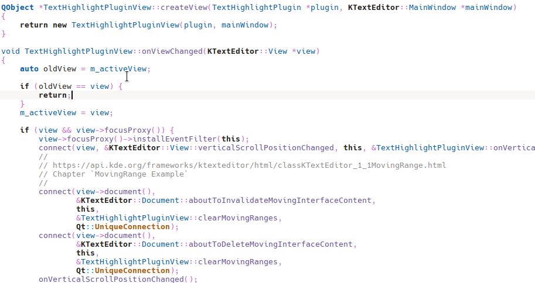

# Kate Text Highlight Plugin

This plugin is designed to make reading logs easier.



# Build

The KDE Framework (KF) is required. I have only tested this with KF6, as I do not have a KF5 environment.

## Without Kate

```bash
cd kate-text-highlight-plugin
mkdir build
cd build
cmake .. -DCMAKE_INSTALL_PREFIX=/usr
cmake --build .
```

## With Kate

Put this plugin to `your_kate_source_path/addons/`, and build kate.

# How to use

## Installation

Build it by yourself or download the release version from the [release page](https://github.com/flylai/kate_text_highlight_plugin/releases). and put `text-highlight-plugin.so` to `/usr/lib/qt6/plugins/kf6/ktexteditor/`.

## Activation

Open Kate, find `Settings` on the menu bar, choose `Configure Kate...`, click `Plugin` on the left side, find `Text Highlight` on the right side and check it. back to the editor and enjoy it.
